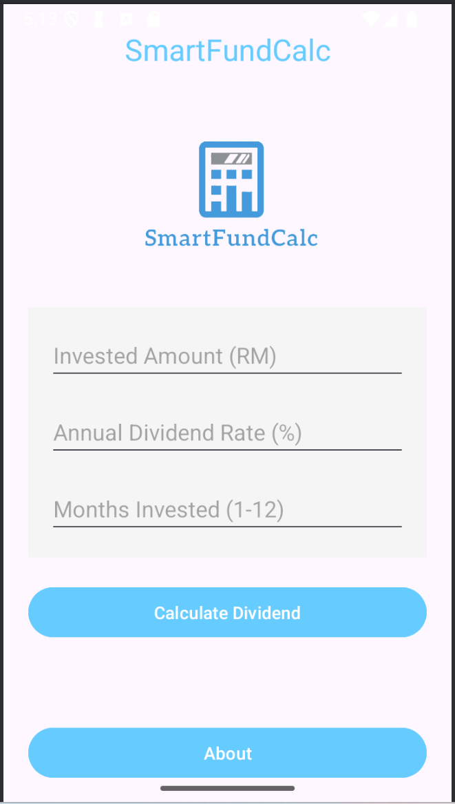
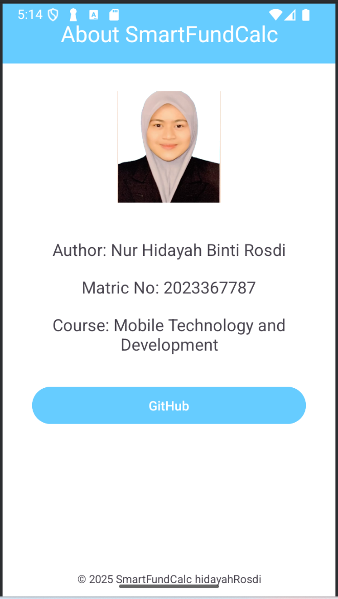

# 📱💰 SmartFundCalc

**SmartFundCalc** is a simple and user-friendly mobile application designed to help users calculate dividends from their unit trust investments with ease. This project is created as part of an individual assignment to demonstrate knowledge in mobile application development.

## 📌 Features

- 🔢 **Dividend Calculator** – Calculate expected returns from your unit trust investments.
- 💸 **Flexible Input** – Enter your investment amount, annual dividend rate, and investment duration.
- 📈 **Instant Result Display** – View total dividends and estimated final amount clearly.
- 📱 **User-Friendly Interface** – Clean and modern design that’s easy to navigate.
- 💾 **Optional Save/Reset** – Easily reset input fields or save your data for future use.

## 📷 Screenshots

  
   <em>Homepage</em>

  
   <em>About Page</em>

